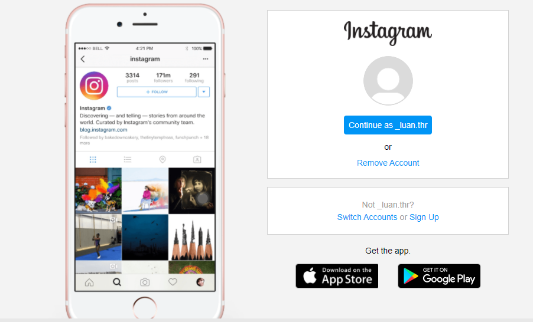
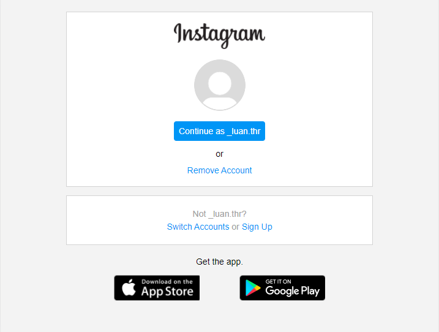
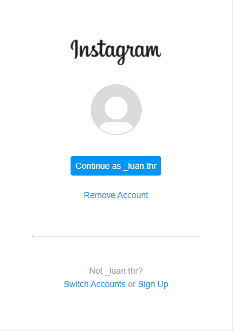

# Clone da interface do instagram responsiva.

### Em Computador:

### Em Tablet:

### Em celular:

###### Sobre o projeto:
>Esse clone foi um projeto muito utíl, onde aprendi usar a responsividade e o posicionamento flex. Além de aprender a trabalhar com as classes HTML para modificar elementos unicos.

[Visualize Aqui.](https://luanthierry.github.io/Tela_Instagram/)
